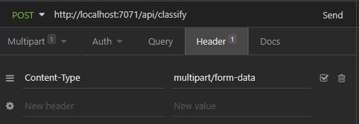

# Azure Serverless Function for Image Classification

Deployment model for image classification app using Azure Functions. Utilizes ONNX runtime for optimized performance. To export the image classifier model in the Fast AI course (or any Pytorch model in that case), use the following:

```python
dummy_input = torch.randn(1, 3, 224, 224)
onnx_path =  "./model.onnx"
torch.onnx.export(learn.model, dummy_input, onnx_path, verbose=False)
```

Make sure to copy the model to `start/classify/model.onnx` and also add labels to `start/classify/labels.json`

```json
["baya weaver", "magpie robin", "sparrow"]
```

For azure local development, install:

1. [Azure Functions Core Tools](https://docs.microsoft.com/en-us/azure/azure-functions/functions-run-local#v2)
2. Python 3.9

For deployment to azure, install [Azure CLI](https://docs.microsoft.com/en-us/cli/azure/install-azure-cli)

## Local development setup

```bash
cd start

# init functions
func init --worker-runtime python
func new --name classify --template "HTTP trigger"

# Enable virtual env and install dependencies
python -m venv venv
source venv/bin/activate
python -m pip install -r requirements.txt

func start --cors *
```

To test use an API client (or application) to send a `POST` request with `multipart/form-data` along with an input with key of `file` to http://localhost:7071/api/classify. For example using Insomnia:



## Deployment

To deploy to Azure, create a Azure Storage Account and Azure Function (using consumption plan is good enough for a basic deployment) using either Azure Portal or CLI. Make sure to also add the `AzureJobsStorage` and `AzureWebJobsDashboard` configuration keys to `DefaultEndpointsProtocol=https;AccountName=[name];AccountKey=[key]`

Make sure you are logged in to Azure CLI:

```bash
az login
```

Publish app:

```bash
func azure functionapp publish [[YOUR Function App name]]
# Note that you can add `--no-build` params on later deploys to avoid rebuilding packages.
```

You can always check the URL of the deploy using:

```bash
azure functionapp list-functions [[YOUR Function App name]] --show-keys
```
